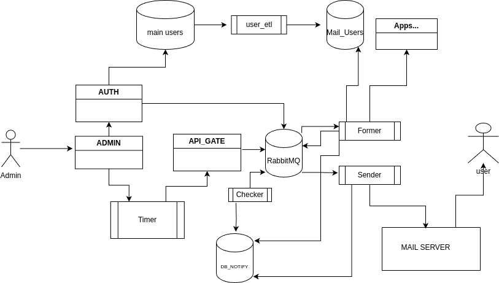

# Проектная работа 10 спринта

https://github.com/hegelianer26/notifications_sprint_1/

В какой-то момент все начало усложняться…

**admin_postman**:
   - Создание шаблонов писем и кампаний по рассылке, двух типов: периодические и одноразовые.
   - Назначение кампаний на группы пользователей, по умолчанию на группу "basic" (все пользователи).

**timer**:
   - Планировщик для запуска кампаний (используется Celery Beat).

**api_gate**:
   - Пересылка кампаний в очередь RabbitMQ.

**RabbitMQ**:
   - Очереди для кампаний и готовых к отправке уведомлений.

**notify_db**:
   - База данных для хранения кампаний и истории уведомлений.

**former**:
   - Процесс для наполнения кампании данными о пользователях (и, возможно, другой информацией из других сервисов) и регистрации рассылки в `notify_db`.

**mail_users**:
   - Дополнительная база с данными о пользователях (ФИО, email).

**user_elt**:
   - Процесс для ежедневного обновления базы данных с данными о пользователях.

**sender**:
   - Процесс для отправки писем на почтовый сервер.

**checker**:
   - Процесс для проверки статуса писем и повторного запуска в случае неудачи.

**auth**:
   - Управление группами рассылки (создание, удаление)
   - Генерация приветственных писем при регистрации пользователей

